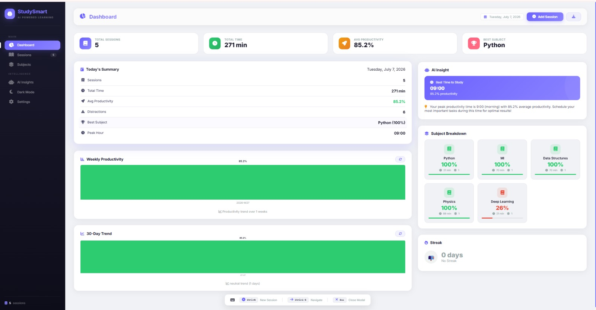
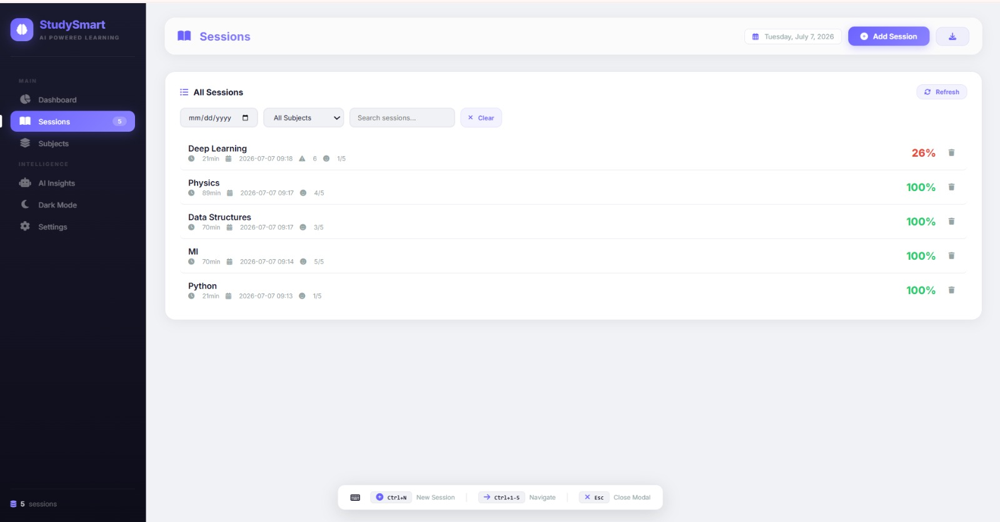
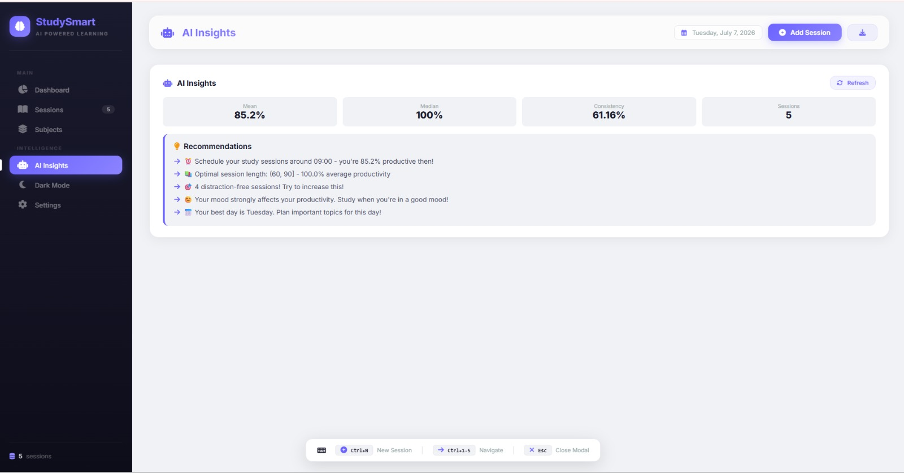
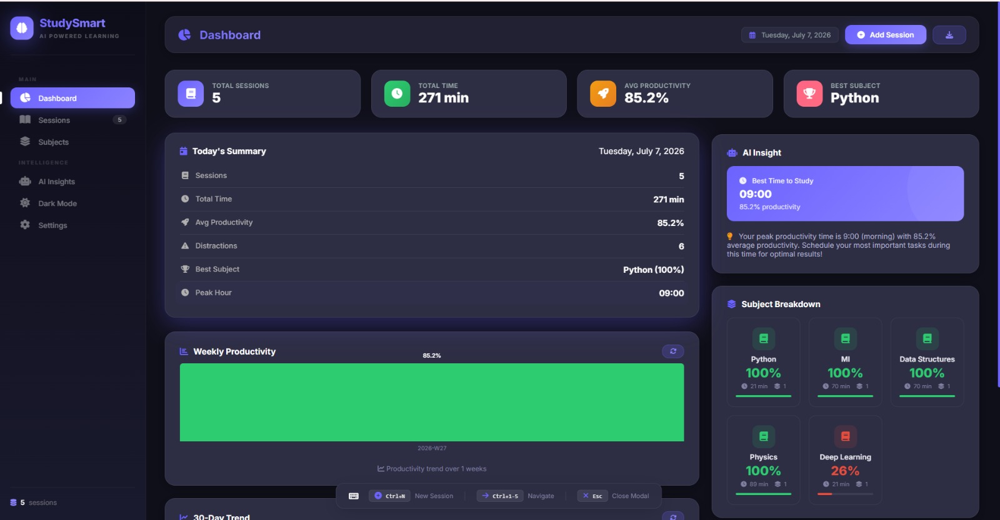
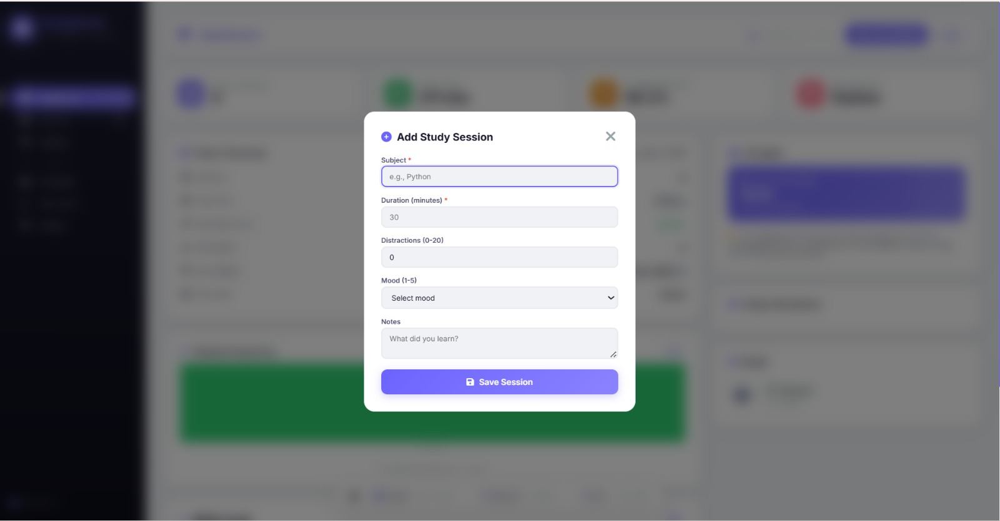
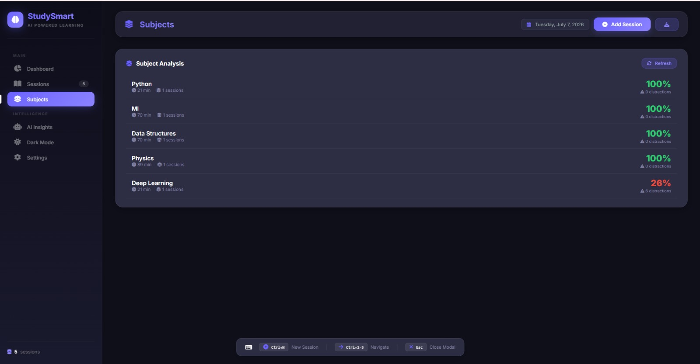
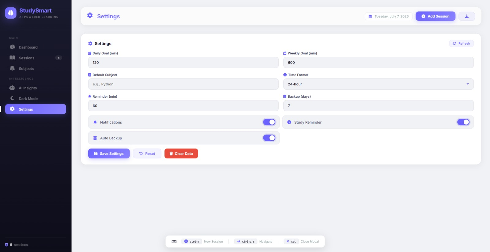
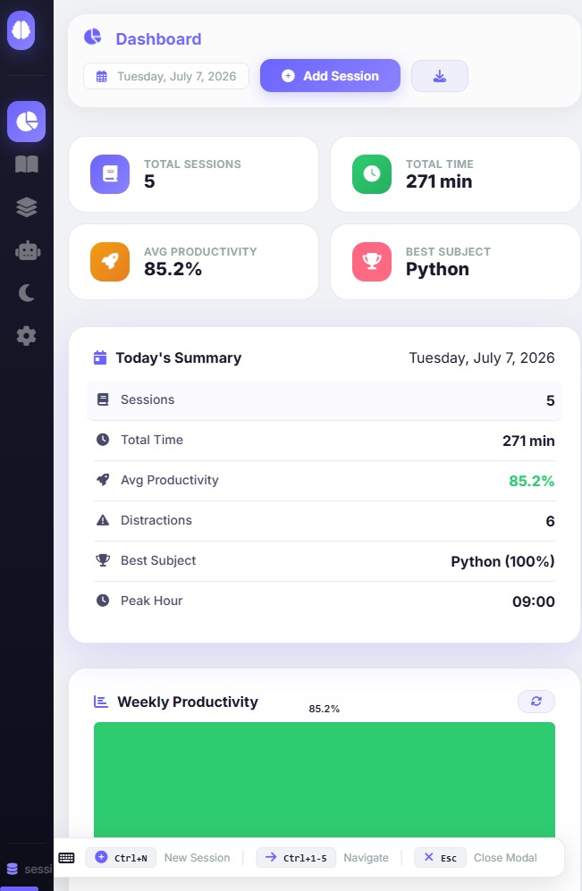

# 🧠 StudySmart AI - Intelligent Study Tracking System

[](https://python.org)
[](https://flask.palletsprojects.com)
[](LICENSE)
[]()

> **Study Tracker with Statistical Analytics & Personalized Recommendations**

---
## 📸 **Screenshots**

### 🖥️ **Dashboard**


### 📊 **Sessions Management**


### 🤖 **AI Insights**


### 🌙 **Dark Mode**


### 📱 **Add Session**


### 📚 **Subject Analysis**


### ⚙️ **Settings**


### 📱 **Responsive Design**


### 🏆 **Banner**


## 📖 **Project Overview**

**StudySmart AI** is a study tracking system that helps students understand their learning habits. It logs study sessions (subject, duration, distractions, mood, notes), calculates a productivity score for each one, and analyzes the resulting history with statistical methods (pandas/NumPy — pattern detection, correlation, anomaly detection, linear-trend forecasting) to surface insights, predictions, and rule-based recommendations. It ships as both a Flask web app and a terminal CLI, sharing the same core engine and JSON-file storage.

### 🎯 **What Problem Does It Solve?**

| **Problem** | **Solution** |
|-------------|--------------|
| ❌ Students don't track study time effectively | ✅ Session logging with duration, distraction count, mood & notes |
| ❌ No visibility into productivity patterns | ✅ Statistical analytics with charts, correlations & anomaly detection |
| ❌ Difficult to identify best study times | ✅ Hourly productivity averages to surface peak study hours |
| ❌ No personalized study recommendations | ✅ Rule-based recommendation engine with actionable tips |
| ❌ Data loss risk | ✅ Automatic JSON backups with restore support |
| ❌ No progress tracking | ✅ Streak tracking, weekly reports & progress-over-time comparisons |

---

## ✨ **Key Features**

### 🎨 **User Experience**
- 🌙 **Dark/Light Mode** - Theme toggle persisted in `localStorage`
- 📱 **Responsive Layout** - Single-page dashboard with CSS media queries
- ⌨️ **Keyboard Shortcuts** - Ctrl+N (new session), Ctrl+1-5 (switch sections), Esc (close modal)
- 🔔 **Toast Notifications** - Real-time feedback on actions
- 🔥 **Streak Tracking** - Consecutive-day study streak shown on the dashboard

### 📊 **Study Analytics**
- 📈 **Productivity Scoring** - Score computed from session duration & distraction count
- 📊 **Weekly Stats** - Session counts and time totals for the last 7 days
- 📚 **Subject Analysis** - Per-subject session count, time and average mood
- ⏰ **Optimal Study Times** - Best hours ranked by average productivity score
- 📉 **Period Comparison** - Current week vs. previous week

### 🧠 **Statistical Insights & Recommendations**
> Implemented with pandas/NumPy statistics (mean, std-dev, Z-score, correlation, linear regression) — not trained machine-learning models. `scikit-learn` is listed as a dependency but is not currently used by the codebase.

- 🔍 **Pattern Detection** - Best/worst day, best hour, most/least consistent subject
- ⚠️ **Anomaly Detection** - Flags outlier sessions using Z-score (|z| > 2)
- 🔗 **Correlation Analysis** - Duration/distractions/hour vs. productivity correlation
- 📈 **Trend Forecasting** - Next-week productivity & session-count estimate via linear regression
- 🎯 **Risk Assessment** - Distraction/productivity risk score with High/Medium/Low rating
- 💡 **Rule-Based Recommendations** - Distraction, subject-gap, timing, consistency & break tips
- 🗣️ **Motivational Messages** - Short encouragement based on total hours and recent trend

### 💾 **Data Management**
- 💾 **JSON Storage** - Primary storage; thread-safe, singleton, with an in-memory cache
- 📁 **Auto Backups** - Timestamped backups on write, with cleanup of old backups and one-click restore
- 📤 **CSV Export** - Download all sessions as a CSV file
- 🗄️ **SQLite module** - `src/storage/database.py` implements a SQLite-backed store but is not wired into the web app or CLI (both use `JSONStorage`); treat it as an unused/experimental module

### ⚙️ **Settings**
- 🎨 **Theme** - Light / Dark
- ⏰ **Time Format** - 12h/24h field (stored; not yet reflected across all UI timestamps)
- 📅 **Study Goals** - Daily & weekly minute targets
- 🔔 **Notification Preferences** - Reminder toggle & interval
- 🌐 **Language field** - Settings store a `language` code, but no translations exist yet — the UI is English-only regardless of this setting

---

## 🛠️ **Tech Stack**

### **Backend**
| Technology | Purpose |
|------------|---------|
| **Python 3.8+** | Core programming language |
| **Flask 2.3.2** | Web framework |
| **Flask-CORS** | Cross-origin request support |
| **Pandas** | DataFrame-based statistical analysis |
| **NumPy** | Numerical computations, linear regression |
| **JSON** | Primary session & settings storage |
| **SQLite3** | Available via `src/storage/database.py`, currently unused by the app |

### **Frontend**
| Technology | Purpose |
|------------|---------|
| **HTML5** | Structure (single-page app: `index.html`) |
| **CSS3** | Styling, dark/light theme, responsive layout |
| **Vanilla JavaScript** | Section navigation, API calls, charts rendering, shortcuts |
| **Font Awesome** | Icons |
| **Google Fonts (Inter)** | Typography |

---

## 📁 **Project Structure**

```bash
Study_Smart_AI/
├── web/                              # Flask Web Application
│   ├── static/
│   │   ├── css/style.css             # Styling
│   │   └── js/script.js              # Frontend logic (SPA navigation, API calls, charts)
│   ├── templates/
│   │   └── index.html                # Single-page app (dashboard/sessions/subjects/insights/settings are sections within this page)
│   ├── app.py                        # Flask app entry point (run this to start the web server)
│   └── routes.py                     # Alternate route registrar (not used by app.py's __main__)
│
├── cli/
│   └── main.py                       # Terminal CLI entry point (menu-driven)
│
├── src/                               # Core Source Code
│   ├── ai/
│   │   ├── analyzer.py               # Statistical pattern analysis & insights
│   │   ├── predictor.py              # Linear-regression-based forecasting
│   │   └── recommender.py            # Rule-based recommendations & motivational messages
│   │
│   ├── core/
│   │   ├── session.py                # Session data model
│   │   ├── productivity.py           # Productivity scoring & report generation
│   │   └── analytics.py              # Additional analytics helpers
│   │
│   ├── storage/
│   │   ├── json_storage.py           # JSON file storage (used by the app)
│   │   └── database.py               # SQLite storage (not currently wired in)
│   │
│   └── utils/
│       ├── helpers.py                # Utility functions
│       └── validators.py             # Input validation
│
├── data/                              # User Data
│   ├── sessions.json                 # Study sessions
│   ├── user_settings.json            # User preferences
│   ├── study.db                      # SQLite file (unused by the app currently)
│   └── backups/                      # Automatic JSON backups
│
├── exports/                           # CSV exports land here
├── logs/                              # Application logs (web.log, cli.log)
├── tests/                             # Unit tests
│   ├── test_analytics.py
│   ├── test_productivity.py
│   └── test_session.py
│
├── .env                                # Environment variables (SECRET_KEY, PORT, FLASK_DEBUG)
├── requirements.txt                    # Python dependencies
└── README.md
```

---

## 🚀 **Getting Started**

### Install dependencies
```bash
pip install -r requirements.txt
```

### Run the web app
```bash
python web/app.py
```
Then open `http://localhost:5000`. Port and debug mode can be overridden with the `PORT` and `FLASK_DEBUG` environment variables.

### Run the CLI
```bash
python cli/main.py
```
Menu options: Add Study Session, View Today's Dashboard, Weekly Report, Subject Analysis, AI Insights & Recommendations, Manage Sessions, Edit Session, Search Sessions, Backup & Restore, Statistics.

### Run tests
```bash
pytest tests/
```

---

## ⚠️ **Known Gaps**

- `web/app.py` and `web/routes.py` both define a full route set independently (there's duplication between the two — only `web/app.py` is actually run).
- The `/dashboard` and `/settings` routes in both files call `render_template('dashboard.html')` / `render_template('settings.html')`, but only `index.html` exists in `web/templates/` — those two routes will error if hit directly. The working UI navigates within `index.html` via JavaScript instead.
- `scikit-learn`, `matplotlib`, and `seaborn` are listed in `requirements.txt` but are not imported anywhere in `src/` — the analytics are pandas/NumPy statistics, not trained ML models or rendered chart images.
- Multi-language support and an in-app achievement/confetti system are not implemented.
